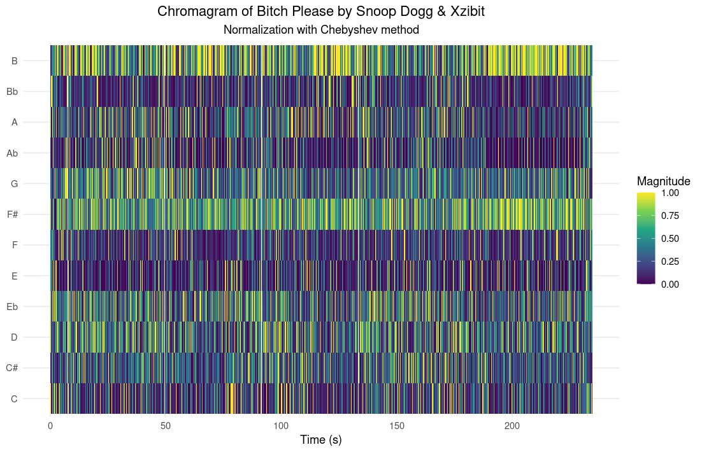
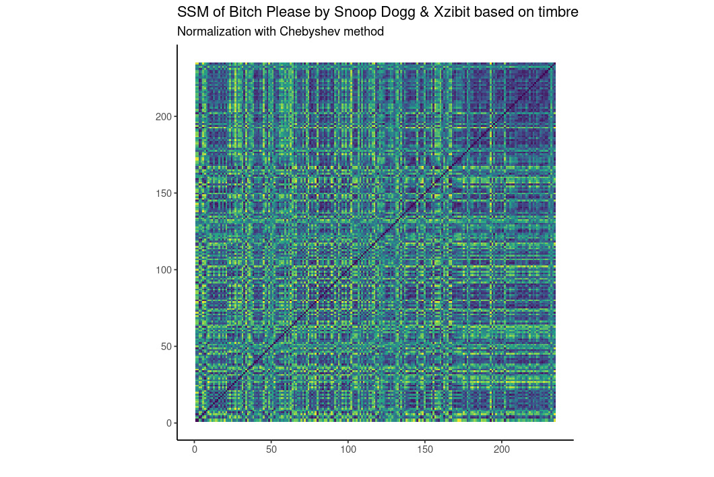

### Homework week 9

#### Introduction
In the late 1990s and early 2000s, American hip-hop was marked by a West Coast vs. East Coast feud, with fans strongly aligned to one side. The rivalry ultimately led to the deaths of Tupac and Biggie. For this week, I made visualisations for the song 'Bitch please' by Snoop Dogg and Xzibit. I chose this song as it is statistically the most west-coast, meaning its audio profile sits closest to the overall average of all West Coast tracks (Only considering spotifies features). 

#### Chromagram

In this chromagram, you can see that the song is mostly in the keys B and F#, with G being high in the beginning of the song, but becoming less prominant later. This repetitiveness of pitches (i.e. the B and F#) can be explained by the fact that most rap songs have a looped sample, which repeat throughout the whole song

#### SelfSM timbre features

In this self-similarity matrix, you can see that the song features a highly dense, checkerboard-like pattern across the entire track, with consistent horizontal and vertical stripes indicating regular, repeating intervals of high similarity. This intense repetitiveness in the song's timbre can be explained by the fact that most rap songs, particularly from this era of West Coast hip-hop, are built on a continuous, looped instrumental beat, meaning the underlying drum textures, basslines, and instrumentation repeat almost entirely unchanged throughout the whole song.

